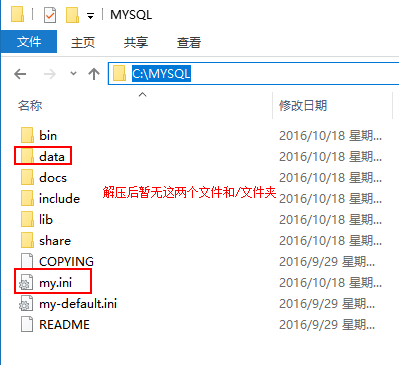
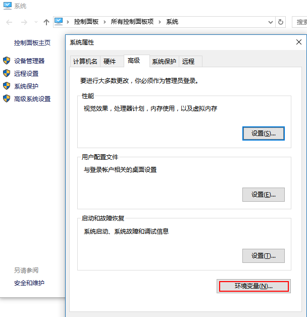
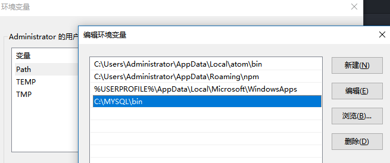
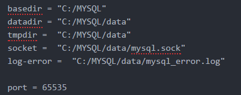
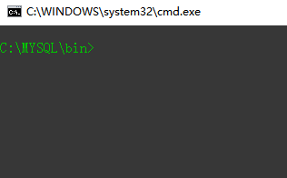
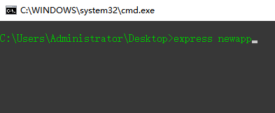

<h1 style="text-align:center">使用Express搭建Web项目(mysql篇)</h1>
## 知识介绍
* SQLyog，数据库管理工具

	数据库对于前端开发，也是尤其重要的，比如，你在公司做完一个转盘抽奖特效，你需要测试的时候就要不断去修改数据库

* Express WEB项目搭建框架

	Express项目中，使用js来编写前端和后端，甚至连接数据库，典型的全栈开发模式。目前，很多公司都会使用Express搭建网站、平台类的WEB项目，或者使用类似原理开发这样的技术。因此，掌握这样一门技术，可以说明你有全栈工程师的基础能力

## 学习目标

* 掌握Mysql的安装，会自己成功安装Mysql
* 会用SQLyog进行数据库的基本管理，能够自己连通数据库，修改数据
* 会独立安装和配置Express，能够使用手机通过ip地址访问电脑上的Express项目

## 工具安装

### 1. Mysql - 一个关系型数据库管理系统

#### 1.1 下载MySQL

链接: (mysql-5.7.16-win32.zip)[http://dev.mysql.com/downloads/mysql/]

	MySQL建议安装 ZIP Archive (解压缩版)

#### 1.2 解压

将下载好的MySQL解压到系统目录下，并在mysql文件夹下创建一个data文件夹，内容保持为空，如下：

#### 1.3 添加环境变量

将mysql下的bin文件夹路径加入到系统环境变量中

	例如，我的路径是 C:\MYSQL\bin

#### 1.4 设置mysql

将解压出来的my-default.ini文件复制一份，改名为my.ini,内部主要配置如下：

这里需要记住，我们的mysql端口默认为3306，本次我们设置为65535

#### 1.5 CMD

在命令行工具中，进入mysql下的bin文件夹中，如下：

在bin文件夹下打开cmd命令行工具的快捷方式有两种

	* 按住shift键，同时在bin文件夹下空白处点击鼠标右键，会出现“在此处打开命令窗口”
	* 在地址栏，清空内容，输入cmd并回车

#### 1.6 CMD 安装命令

	* mysqld --initialize-insecure
	* mysqld install
	* net start mysql

如果提示服务启动成功，则证明mysql已经安装好并成功启动

### 2. SQLyog - 可视化数据库管理工具

#### 2.1 下载安装
#### 2.2 打开之后

选择新建，起好名字之后，输入配置信息，配置信息参考my.ini

### 2.3 导入数据

在数据库主机上右键，执行外部SQL文件，导入数据

[post.sql](Sorce/post.sql)

## 项目开始

### 1. 安装 express-generator

express-generator 是express团队为了快速搭建express项目而开发的另外一个package
express-generator 需要全局安装，安装成功后，可以在任意位置，通过express命令创建express

### 2. 安装 express ...

express是我们要做的web项目所依赖的框架，同样是一个packages

由于我们使用express-generator来创建项目，因此已经在package.json中声明了我们需要用的packages，因此我们直接使用npm install / cnpm install 来安装这些packages

### 3. 安装 mysql driver

这里，我们用npm 安装 mysql 这个package，这是一个基于nodejs开发的mysql driver

	npm install mysql --save / cnpm install mysql --save

文档: [mysql](https://www.npmjs.com/package/mysql)
