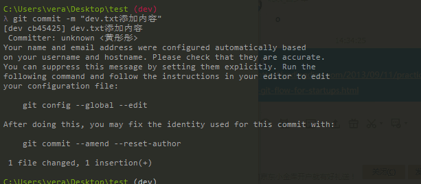
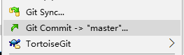
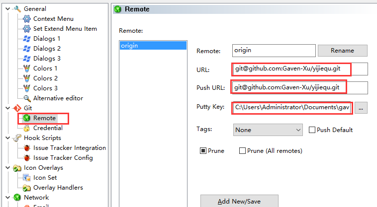

<h1 style="text-align:center">团队协作开发-Git</h1>


<!-- toc orderedList:0 depthFrom:1 depthTo:6 -->

* [知识介绍](#知识介绍)
* [学习目标](#学习目标)
* [准备工作](#准备工作)
* [1. Git](#1-git)
	* [1.1. Git常用命令](#11-git常用命令)
	* [1.2. Git分支管理](#12-git分支管理)
	* [1.3. 分支回退](#13-分支回退)
	* [1.4 常见问题](#14-常见问题)
		* [git的global信息没有配置正确：](#git的global信息没有配置正确)
	* [1.5. 合作开发规范](#15-合作开发规范)
	* [1.6. 小乌龟Git](#16-小乌龟git)
		* [安装与密钥生成](#安装与密钥生成)
		* [连接](#连接)
		* [操作](#操作)
* [2. 仓库准备(讲师)](#2-仓库准备讲师)
* [3. 开发者本地仓库准备](#3-开发者本地仓库准备)

<!-- tocstop -->


## 知识介绍

在团队协作开发中，我们需要面对的问题主要是如何协作。
在开发过程中，我们又应该有上线、之前的最稳定版本、测试、开发多个版本，这么多版本之间如何管理与合并，也是问题之一。
如果code修改出了问题，如何回退到之前的修改。
而这些问题，就涉及到我们的版本控制系统了Git、SVN
Github Desktop

## 学习目标

* Git 命令行
* 协作开发规范
* TortoiseGit 小乌龟协作开发工具
* 使用Github.com、码云进行协作开发

## 准备工作

github.com账号
cmder安装

		* cmder文件夹添加到PATH环境变量中
		* 以管理员模式打开cmd，输入 cmder.exe /REGISTER ALL

git安装

## 1. Git
### 1.1. Git常用命令
```cmd
基本命令：
git init
git remote add origin [远程地址]

查看远程
git remote -v

添加 提交
git add . // 把修改[增删]的文件，放入准备提交的列表
git commit -m "[提交消息]"  // 提交消息一定要输入，尽量完整

推送
git push <远程主机名> <远程分支名>
// git push origin master
git push <远程主机名> <本地分支名>:<远程分支名>
// git push origin dev:dev

拉取
git pull <远程主机名> <远程分支名>
// git pull origin master
git pull <远程主机名> <远程分支名>:<本地分支名>
// git pull origin dev:dev

git log // 查看操作记录（commit/merge）
```
### 1.2. Git分支管理
```cmd
查看分支
	git branch -v

查看远程分支（所有）
	git branch -a

创建本地分支
	git checkout -b [分支名称]
    //使用已经存在的远程分支创建本地分支，建议第二种
    git checkout -b [本地分支名称] [本地分支名称] // 使用后一个分支来创建前一个分支
	git checkout -b [本地分支名称] origin/[远程分支名称]
	git checkout --track origin/[远程分支名称]

切换本地分支
	git checkout [分支名称]

合并分支
	git checkout master
	git merge [你要合并的分支名称]  
	// 前提，已经在你的主干分支(master)上

删除分支
	git branch -d [分支名称] // -D 表示强制删除

删除远程分支
	git push origin --delete [需要删除的远程分支名称]
```

### 1.3. 分支回退
```cmd
git log //  commit和merge记录
git reflog // “所有”操作记录

git reset --hard [23472478]
```
### 1.4 常见问题

#### git的global信息没有配置正确：

git config --global user.name "[你的名字]"
git config --global user.email "[你的邮箱地址]"

### 1.5. 合作开发规范
原则一：除了仓库之后的第一次提交，每次先pull，再push。
原则二：各人修改各人的文件，不要同时修改同一个文件。
原则三：个人开发，一定要开辟本地分支来做，做好了merge
原则四：频繁做commit，这样出了错才知道reset到哪里去

问题1：准备做项目了，主管弄好了git仓库，你应该做什么？
问题2：项目需要添加新功能，你该怎么做？
问题3：功能刚刚提交之后，发现有bug，你该怎么做？
问题4：某个功能需要修改，你应该怎么做？

### 1.6. 小乌龟Git

#### 安装与密钥生成
* puttygen 生成密钥
* puttygen 读取密钥，添加密钥到git远程仓库（github.com）

#### 连接
* 通过小乌龟，将本地文件夹初始化为一个仓库



* setting > remote 添加远程ssh地址



#### 操作
* switch/checkout

		切换到远程的dev分支，默认本地也会创建一个dev分支，并且对应

* commit

		每次操作都可以以commit开始，也是比较推荐的方式。

		commit结束之后，会提醒需要做什么操作。

		最好，commit结束后，先pull，后push

* fetch

		如果远程创建了新的分支，fetch操作用来同步分支信息

* pull
* push

## 2. 仓库准备(讲师)
仓库主要目的

    在github网站上/码云，创建好项目仓库(repository)/(project)，开发过程中的代码会集中提交到这里。并且，该仓库应该具备至少两个分支

    一个master作为最终上线的项目

    一个dev作为开发过程中的测试版本

    如果devs测试没有问题，由管理员merge到master分支上，也就是所谓的“发版本”

0. 创建好仓库yijiequ，创建readme.md文档
0. 默认仓库分支为 master
0. 创建 dev 分支
0. 并在setting中设置默认分支（default brach）为 dev
0. 设置master为保护分支(protect branch)

## 3. 开发者本地仓库准备
