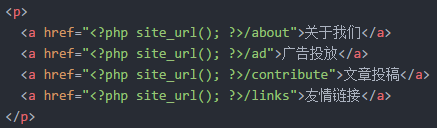

<h1 style="text-align:center">服务器是啥</h1>

---

### 服务器的概念

* 响应服务请求，并进行处理的设备
* 一般包括：文件服务器，数据库服务器，应用程序服务器，WEB服务器

	> 在实际项目中，这几个 “ 服务器 ” 可能是一台设备上的不同程序或者服务

---

### 页面是怎么出现在浏览器上的？
第一步
- 页面打开的时候，会有一个80端口的web请求
- 这个请求的意思是，我想访问你web服务器上的“首页”
- 而首页默认为一个动态页面（程序入口）：index.php、index.asp、index.jsp、index.vm等各种各样
- 命名一般是服务器设置的，当然也可以设置shouye.php这样的奇葩名称，但以index开头成了一种默契

第二步
- 服务器接到请求之后，将后端代码编译成静态的html
- 例如<?php echo '123'?>这样的代码，会编译为123，以填空的方式，替换代码所在位置，生成html静态页面



第三步
- 浏览器收到服务器返回的html，按照浏览器默认css、和css文件，完成DOM渲染，然后执行js

---

### 前端开发该怎么做
1. 我们要明确，我们一般不会去写html文件，而是在.php之类的后端脚本里面用html语言编写代码.
> node项目例外

```
getElementById();
get_post();
```

2. 我们的php（或者其他的后端脚本）、css、js以及各种代码，主要放在服务器上。

3. 我们拿到UI设计图之后，首先在.php之类后端脚本里面，用html写好布局，以及css和js动效。

4. 与此同时，我们拿到后端提供给我们的数据和接口，利用数据和接口实现需求

> php取数据可能会是这样 <?php get_post();?>

> 接口一般是一个地址 例 http://api.jisuapi.com/iqa/query

> 接口使用方式 例 http://api.jisuapi.com/iqa/query?appkey=yourappkey&question=杭州天气
