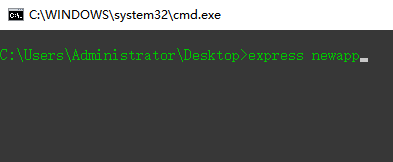

[TOC]

<h1 style="text-align:center">使用Express搭建Web项目(安装篇)</h1>
### 1. 安装 express-generator

express-generator 是express团队为了快速搭建express项目而开发的另外一个package
express-generator 需要全局安装，安装成功后，可以在任意位置，通过express命令创建express

### 2. 安装 express ...

express是我们要做的web项目所依赖的框架，同样是一个packages

由于我们使用express-generator来创建项目，因此已经在package.json中声明了我们需要用的packages，因此我们直接使用npm install / cnpm install 来安装这些packages

### 3. 运行

### 4. 文件夹

### 5. 前后端交互
