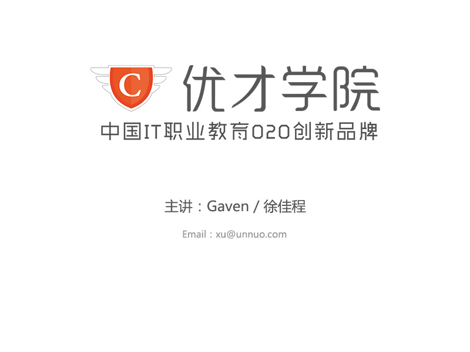

<h1 style="text-align:center">CMS建站简介</h1>
<!-- toc orderedList:0 depthFrom:1 depthTo:6 -->

- [说明](#说明)
	- [知识介绍](#知识介绍)
	- [学习目标](#学习目标)

<!-- tocstop -->

---
# 说明

## 知识介绍

网站建设，是前端的工作内容之一；在长久以来的网站开发过程中，开发者发现，大多数网站的主要功能是类似的：网站内容的管理。例如：文章管理、媒体管理、用户管理等。因此，就出现了CMS（Content Management System）。
CMS开发好了常用的网站功能，并提供了一套用来开发网站页面的“模板语言”，可以让程序员通过少量的二次开发来建设网站。
而我们将要学习的wordpress，就是一款基于php开发的开源cms，在比较良好的用户基础，并且上手容易。

## 学习目标

了解wordpress的文章管理、分类管理、菜单管理、用户管理、主题管理、插件管理
