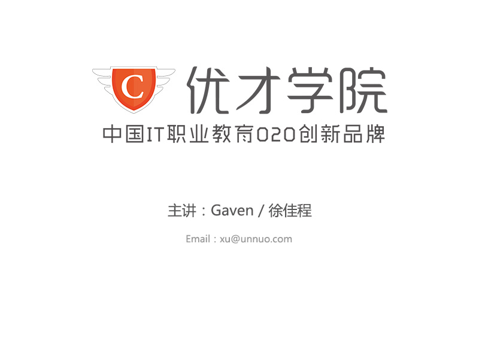

<h1 style="text-align:center">wordpress</h1>
<!-- toc orderedList:0 depthFrom:1 depthTo:6 -->

- [说明](#说明)
	- [知识介绍](#知识介绍)
	- [学习目标](#学习目标)

<!-- tocstop -->

---
# 说明

## 知识介绍

wordpress的安装内容主要在于文件的放置和数据库连接，比较简单

## 学习目标

跟随老师一起完成wordpress的安装与配置
